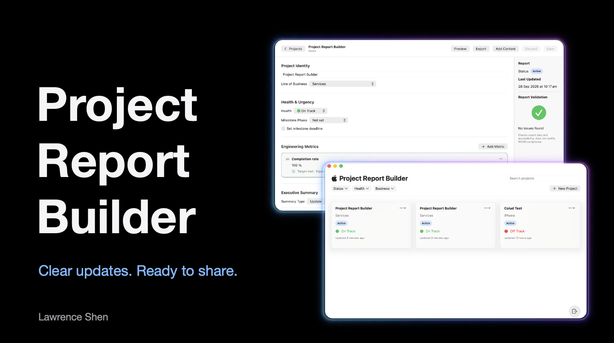
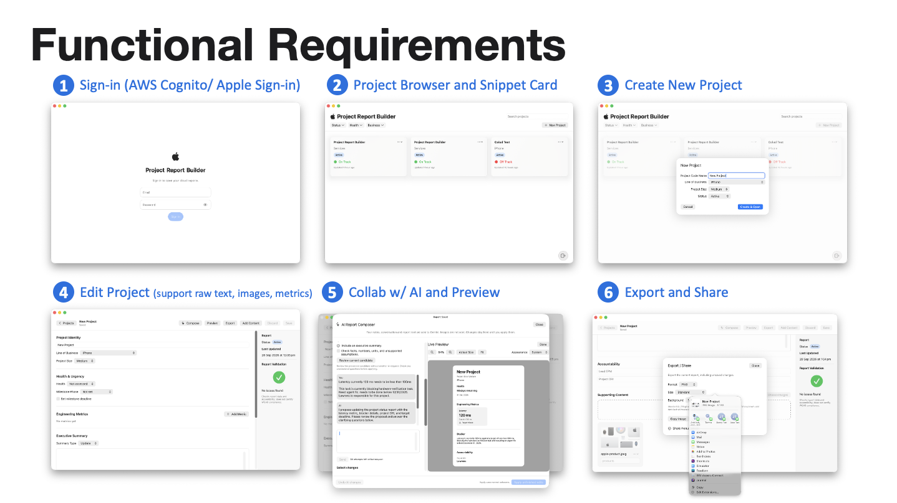
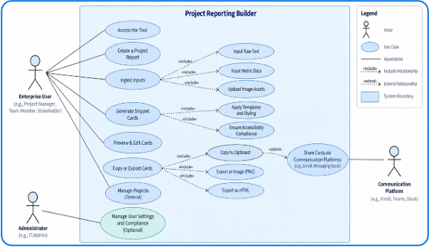
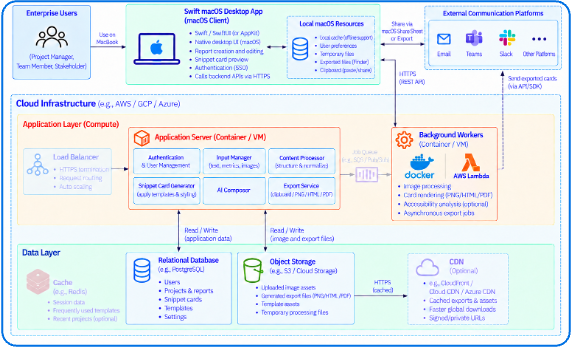
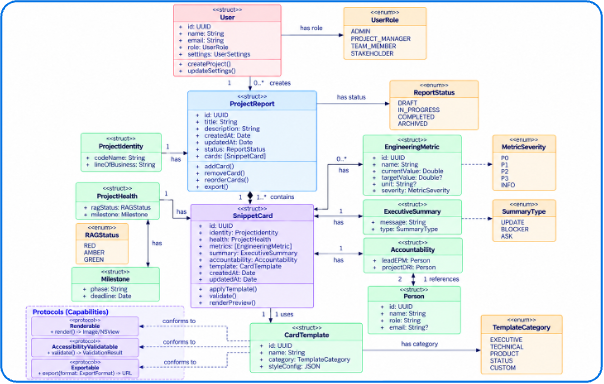

# Project Report Builder

Create clear, shareable project reports in a native macOS app.
Bring project updates, milestones, metrics and images together, save them to the
cloud, and export your report as PNG or HTML.

**Sign in → Create a report → Add content → Preview → Share**

Watch the [happy path demo](assets/happy-path-demo.mp4) (2 min).

AI-assisted drafting is available as a development preview: turn notes into
suggested changes, review them, then apply what you want to keep.

This project is a proof of concept built in five days as the take-home
assessment for an Apple IS&T interview, with access for an approved test account.

## What it covers

- Inputs: paste raw text, add metrics with targets, and import images.
- Snippet card: one structured report card with a live preview.
- Accessibility: alt text is required, and a validation panel flags gaps.
- Sharing: copy as PNG, save as PNG or HTML, or share to email and messaging.
- Cloud: AWS with Cognito, Lambda, DynamoDB and S3, defined with CDK.
- Extra: AI drafting with review before apply, and local backup of drafts.

## Functional requirements

1. Sign in with AWS Cognito or Apple Sign-in.
2. Browse projects as snippet cards.
3. Create a new project.
4. Edit a project with raw text, images and metrics.
5. Draft with AI and preview the report.
6. Export and share.

## Engineering

- Docs for the [report service](backend/README.md) and [AI service](ai-backend/README.md);
  cloud stacks are defined in [infrastructure/](infrastructure/).
- Shared [contracts](backend/contracts/) keep the Swift, Java and Python code in sync.
- Unit and UI tests for the app, plus service and stack tests, run in GitHub Actions.
- Consistent coding and commit conventions; build with `build.sh` and test with `test.sh`.

## System design

Use cases: who uses the tool and what they can do.

Architecture: the macOS client, cloud services and sharing targets.

Domain model: reports, snippet cards, metrics and templates.

The [presentation deck](assets/Project-Report-Builder.pptx) covers the design and decisions.

## Try the demo

Test account: **user@apple.com**.
Test password: *Asdfghjkl1234!*.
This is a shared account; use sample data only.

1. Open the macOS app and sign in with the test account.
2. Choose **Create & Open** to start a report, then add your project updates.
3. Choose **Compose** to draft with AI. Review the suggestions and choose **Apply**
   to add selected changes to your report.
4. Preview your report, then export it as PNG or HTML.

An internet connection is required for cloud reports and AI drafting. AI usage
is limited; no personal Gemini account or API key is needed.

All cloud billing items are monitored and will be disabled two weeks after
submission, after which cloud reports and AI drafting stop working.
